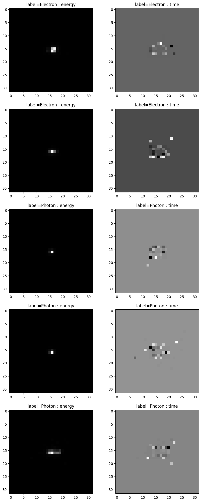
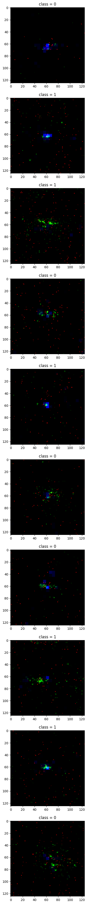

# End-to-End particle classification

## Task 1
The task was a binary classification. A 500000 of 32x32x2 images were provided in hdf5. Data contained equal split between two classes (Electorn and Photon). These images consisted of 2 channels : pixelwise energy of the hit and pixelwise time of the hit. Main problem with data is it's sparsity : only ~1% of the energy channel is non-zero, and ~5-10% of the hit channel is non-zero. Visualization of few randomly selected images : 

Overall goal was to achieve AUC ROC >= 80%. Models has been implemented in All models are contained in [keras](E2E_Task1_keras_final.ipynb) and [pytorch](E2E_Task1_pytorch_final.ipynb). Dataset has been splitted into two parts : 90% for training and 10% for validaton (and model performing best on validation was saved)

| name of the model  |  best AUC ROC on validaton score  |
|---|---|
| basic MLP  | 0.765  |
| CNN 1 : (LeNet based, kernel size = 3)  |  0.797 |
| CNN 2 : (LeNet based, kernel size = 5)  |  0.802 |
| CNN 5 : (convolutions with kernel sizes = [1,2,2,3,3,5,5])  |  0.81 |
| CNN 7 : (convolutions with kernel sizes = [1,2,2,3,3,5,5],larger head)  |  0.816 |
| CNN 7 : (convolutions with kernel sizes = [1,2,2,3,3,5,5],larger head)  |  0.816 |
| CNN 8 : (convolutions with kernel sizes = [1,2,2,3,3,5,5],prelu)  |  0.813 |
| CNN 8 : (convolutions with kernel sizes = [1,2,2,3,3,5,5],prelu)  |  0.813 |
|Resnet18 (from scratch,    11.173 mln parameters)|0.801|
|ConvNeXt (467k parameters)|0.802|
|Ensemble model (7 models, each model was CNN5 trained on seperate subset of data)|0.82|
|MobileViT2|0.809|
|ViT (patch merger)|0.79|

## Task 2
The task is quite similar to Task 1. We have a binary classification problem, with 139328 images of size 125x125x3. Images are split equally into 2 classes (Quark and Gluon). Simillarly the dataset is very sparse. An additional problem, is the size required to store the data : given the images are much larger, much more RAM and VRAM is required. This has been solved by unpacking the initial .parquet files, and saving the images from them to sparse matrices. This created a large folder structure (with 2 subfolders) with ~139k images, that was zipped and saved on google drive. To visualize problem better, image below represent a few random images from the dataset : 

Multiple CNN architectures has been trained for that task, and code for them can be found [here](Task2_pytorch (4).ipynb)

| name of the model  |  best AUC ROC on validaton score  |
|---|---|
| Basic CNN | 0.79  |
|Resnet34 (from scratch,    17.447 mln parameters)|0.8104|
|ConvNext| 0.78|

# References 
- https://paperswithcode.com/sota/image-classification-on-cifar-10
- https://paperswithcode.com/sota/image-classification-on-mnist

# CNN references 
- https://arxiv.org/pdf/2201.03545.pdf
- 